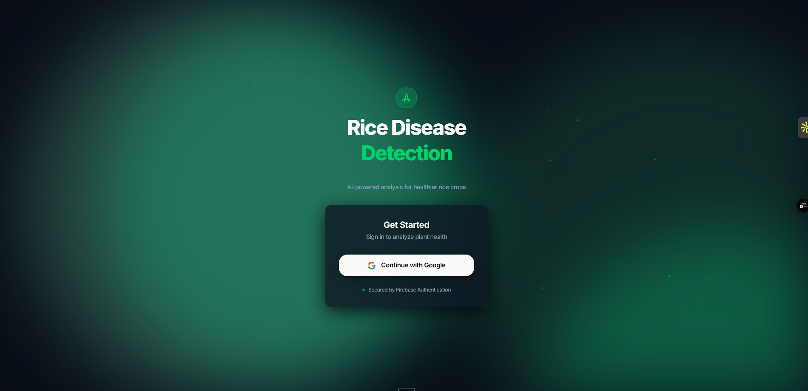

# Rice Disease Detection System

An AI-powered web application for detecting rice plant diseases using deep learning and environmental data analysis.

## [Try the Live App](https://rice-disease.ayushjha.xyz/)

> **Live Demo**: [https://rice-disease.ayushjha.xyz/](https://rice-disease.ayushjha.xyz/)
>
> Upload images, detect diseases, and analyze environmental conditions in real-time.

---


[](https://rice-disease.ayushjha.xyz/)
[](https://rdds-backend.onrender.com)

---

## Screenshots

### Authentication

Sleek Google Sign-In powered by Firebase Authentication.



---

### Image Detection

Upload a rice plant leaf image and get instant CNN-powered disease predictions with confidence scores.


---

### Environmental Condition Analysis

Enter environmental parameters (temperature, humidity, soil pH, precipitation) to assess crop risk.


---

### Prediction History

View all past predictions stored in Firestore with timestamps, user info, and results.


---

## Features

- **Image-Based Disease Detection** — Upload rice plant images and detect diseases via CNN with confidence scores
- **Environmental Analysis** — Analyze temperature, humidity, soil pH, and precipitation for crop health assessment
- **Secure Authentication** — Firebase-powered Google Sign-In with one-click access
- **Prediction History** — Track and review all past predictions stored in Firestore
- **Responsive Design** — Modern glassmorphism UI that works on all devices
- **Real-time Processing** — Fast disease detection with instant feedback

---

## Live Deployment

| Service | URL | Platform |
|---------|-----|----------|
| Frontend | [https://rice-disease.ayushjha.xyz/](https://rice-disease.ayushjha.xyz/) | Vercel (Custom Domain) |
| Backend API | — | Hugging Face Spaces |
| Backend Repository | [AJ115-creator/RDDS-backend](https://github.com/AJ115-creator/RDDS-backend) | GitHub |

---

## Tech Stack

### Frontend

| Technology | Version | Purpose |
|------------|---------|---------|
| React | 18.3 | UI Framework |
| Vite | 6.0 | Build Tool |
| Tailwind CSS | 3.4 | Styling |
| Firebase Auth | 11.0 | Google Sign-In |
| Firebase Firestore | 11.0 | Prediction History Storage |
| Axios | latest | HTTP Client |
| Three.js / React Three Fiber | latest | 3D Background |
| GSAP | latest | Animations |

### Backend

| Technology | Version | Purpose |
|------------|---------|---------|
| FastAPI | 0.95+ | REST API Framework |
| TensorFlow / Keras | 2.12 | CNN Image Classification |
| Scikit-learn | latest | Random Forest (Environmental) |
| NumPy | latest | Data Processing |
| Pillow | latest | Image Processing |
| Uvicorn | latest | ASGI Server |

### Infrastructure

| Service | Purpose |
|---------|---------|
| Google Firebase | Authentication + Firestore Database |
| Render.com | Backend Hosting |
| Vercel | Frontend Hosting |
| Custom Domain | rice-disease.ayushjha.xyz |

---

## Detected Diseases

| Disease | Description |
|---------|-------------|
| Bacterial Leaf Blight | Water-soaked lesions along leaf margins |
| Brown Spot | Oval brown spots with yellow halo on leaves |
| Leaf Smut | Black powdery fungal growth on leaf surface |
| Healthy | No disease detected |

---

## Architecture

```
Rice Disease Detection System
├── Frontend (React + Vite)
│   ├── Firebase Authentication (Google Sign-In)
│   ├── Image Detection Tab  ──────────────────────► FastAPI /predict-image/
│   ├── Environmental Data Tab ─────────────────────► FastAPI /predict-tabular/
│   └── History Tab ────────────────────────────────► Firebase Firestore
│
└── Backend (FastAPI on Render)
    ├── CNN Model (TensorFlow/Keras)  — Image Classification
    └── Random Forest (Scikit-learn)  — Environmental Analysis
```

---

## Quick Start

### Prerequisites

- Python 3.9+
- Node.js 18+
- Git
- Firebase project (for Auth + Firestore)

### 1. Clone Repository

```bash
git clone https://github.com/AJ115-creator/Rice-Disease-Detection-system.git
cd Rice-Disease-Detection-System
```

### 2. Setup Backend

```bash
cd RDDS-backend
pip install -r requirements.txt
uvicorn backend:app --reload
```

Backend runs at: `http://localhost:8000`

### 3. Setup Frontend

```bash
cd Frontend
npm install
npm run dev
```

Frontend runs at: `http://localhost:5173`

### 4. Configure Environment Variables

Create `Frontend/.env`:

```env
VITE_API_URL=http://localhost:8000
VITE_FIREBASE_API_KEY=your_firebase_api_key
VITE_FIREBASE_AUTH_DOMAIN=your_project.firebaseapp.com
VITE_FIREBASE_PROJECT_ID=your_project_id
VITE_FIREBASE_STORAGE_BUCKET=your_project.appspot.com
VITE_FIREBASE_MESSAGING_SENDER_ID=your_sender_id
VITE_FIREBASE_APP_ID=your_app_id
```

---

## Project Structure

```
Rice-Disease-Detection-System/
├── Frontend/
│   ├── src/
│   │   ├── App.jsx             # Main app component (tabs, auth, predictions)
│   │   ├── login.jsx           # Login page with Google Sign-In
│   │   ├── firebaseConfig.jsx  # Firebase configuration
│   │   └── index.css           # Global styles and glassmorphism
│   ├── Screenshot/             # Application screenshots
│   ├── public/                 # Static assets
│   ├── .env                    # Environment variables (not committed)
│   └── package.json            # Node dependencies
├── RDDS-backend/
│   ├── backend.py              # FastAPI application
│   ├── Models/
│   │   ├── cnn_model.h5        # Trained CNN model
│   │   ├── rf_model.pkl        # Trained Random Forest model
│   │   └── scaler.pkl          # Feature scaler
│   └── requirements.txt        # Python dependencies
├── Model creation/
│   ├── Train_cnn.py            # CNN training script
│   └── train_tabular.py        # Random Forest training script
├── Test data/                  # Sample test images per disease category
├── firestore.rules             # Firestore security rules
└── README.md
```

---

## API Documentation

### Health Check

```http
GET /health
```

Returns API status and model availability.

### Image Prediction

```http
POST /predict-image/
Content-Type: multipart/form-data

{ "file": <image file> }
```

**Response:**

```json
{
  "prediction": "Brown_spots",
  "confidence": 0.99,
  "message": "The rice plant is prone to Brown_spots with confidence 0.99."
}
```

### Environmental Prediction

```http
POST /predict-tabular/
Content-Type: application/json

{
  "Maximum_Temperature": 35.0,
  "Minimum_Temperature": 20.0,
  "Temperature": 27.5,
  "Precipitation": 150.0,
  "Soil_pH": 6.5,
  "Relative_Humidity": 75.0
}
```

---

## Testing

### Image Detection

Use images from the `Test data/` folder:

- `bacterial leaf blight/`
- `brown spot/`
- `leaf smut/`
- `healthy/`

### Sample Environmental Values (Favourable Conditions)

```
Max Temperature: 35 C
Min Temperature: 20 C
Avg Temperature: 27.5 C
Precipitation:   150 mm
Soil pH:         6.5
Humidity:        75%
```

---

## Security

- Firebase Authentication with Google OAuth
- Secure API endpoints with CORS configuration
- Environment variable management (`.env` not committed to version control)
- Firestore security rules configured

---

## Performance

| Metric | Value |
|--------|-------|
| Image Processing Time | ~2–3 seconds |
| Environmental Analysis Time | ~1 second |
| CNN Model Size | ~15 MB |
| Random Forest Model Size | ~1 MB |
| Frontend Bundle (gzipped) | ~500 KB |

---

## Roadmap

- [ ] Add more disease types
- [ ] Real-time detection via device camera
- [ ] Treatment recommendations per disease
- [ ] Multilingual support
- [ ] Mobile application (React Native)
- [ ] Batch image processing
- [ ] User dashboard with analytics

---

## Contributing

1. Fork the repository
2. Create your feature branch: `git checkout -b feature/AmazingFeature`
3. Commit your changes: `git commit -m 'Add AmazingFeature'`
4. Push to the branch: `git push origin feature/AmazingFeature`
5. Open a Pull Request

---

## License

This project is licensed under the **MIT License**.

---

## Author

**Ayush Jha**

- Live App: [rice-disease.ayushjha.xyz](https://rice-disease.ayushjha.xyz/)
- Backend Repository: [github.com/AJ115-creator/RDDS-backend](https://github.com/AJ115-creator/RDDS-backend)

---

## Acknowledgments

- [TensorFlow](https://tensorflow.org) — Deep learning framework
- [FastAPI](https://fastapi.tiangolo.com) — Python API framework
- [Firebase](https://firebase.google.com) — Authentication and Firestore database
- [Tailwind CSS](https://tailwindcss.com) — Utility-first CSS framework
- [Vercel](https://vercel.com) and [Render](https://render.com) — Hosting platforms

---

*Made for farmers and agricultural researchers. Help protect rice crops worldwide.*
